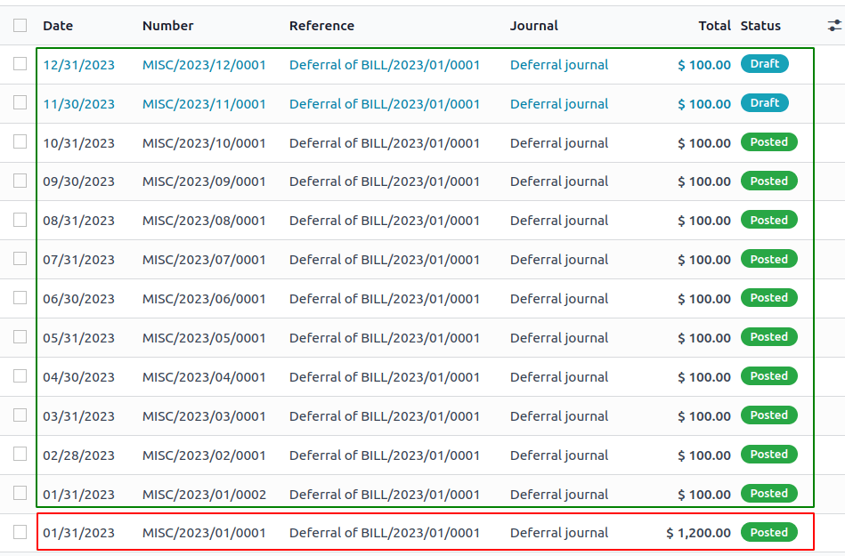

=================
Deferred Expenses
=================

**Deferred expenses** and **prepayments** (also known as **prepaid expense**), are both costs that
have already occurred for unconsumed products or services yet to receive.

Such costs are **assets** for the company that pays them since it already paid for products and
services still to receive or that are yet to be used. The company cannot report them on the current
**Profit and Loss statement**, or *Income Statement*, since the payments will be effectively
expensed in the future.

These future expenses must be deferred on the company's balance sheet until the moment in time they
can be **recognized**, at once or over a defined period, on the Profit and Loss statement.

For example, let's say we pay $ 1200 at once for one year of insurance. We already pay the cost now
but haven't used the service yet. Therefore, we post this new expense in a *prepayment account* and
decide to recognize it on a monthly basis. Each month, for the next 12 months, $ 100 will be
recognized as an expense.

Odoo Accounting handles deferred expenses by spreading them in multiple entries that are
posted periodically.

Configuration
=============

Make sure the default settings are
correctly configured for your business. To do so, go to :menuselection:`Accounting --> Configuration
--> Settings`. There, you will find the following options:

- Journal
    The deferral entries will be posted in this journal.
- Deferred Expense Account
    Expenses will be deferred on this Current Asset account until they are recognized.
- Deferred Expense Account
    Expenses will be deferred on this Current Liability account until they are recognized.
- Generate Entries
    By default, Odoo will :ref:`automatically generate <vendor_bills/deferred/generate_on_validation>`
    the deferral entries when you post a vendor bill. However,
    you can also choose to :ref:`generate them manually <vendor_bills/deferred/generate_manually>`
    by selecting the :guilabel:`Manually & Grouped` option instead.
- Amount Computation
    Suppose you have an bill of $ 1200 that must
    be deferred over 12 months, the :guilabel:`Equal per month` computation will account for $ 100 each month. While
    the :guilabel:`Based on days` computation will account amounts depending on the number
    of days in each month.

.. _vendor_bills/deferred/generate_on_validation:

Generate deferral entries on validation
=======================================

Make sure the :guilabel:`Start Date` and :guilabel:`End Date` fields are visible as shown below:

For each line of the bill, dated in January, you can then specify the start and
end dates of the deferral period. For example, you can defer a purchase of $ 1200 over 12 months
by specifying a start date of 01/01/2023 and an end date of 12/31/2023.

When you validate the bill, Odoo will automatically generate the deferral entries for you.
You can click the :guilabel:`Deferred Entries` smart button to see them.

One entry reverses the expense account and moves it to the deferred expense account.

The other are deferral entries. In the example above, as of 10/31/2023,
$ 1000 are recognized as expense, whereas $ 200 remain as deferred expense.

The Deferred Expenses Report
============================

The deferred expense report computes an overview of the necessary deferral entries for each account.
You can access it by going to :menuselection:`Accounting --> Reporting --> Deferred Expenses`.

You can easily audit the journal items aggregated in an account by clicking on it.

.. note::
    Only bills whose accounting date is before the end of the period of the report are taken into account

.. _vendor_bills/deferred/generate_manually:

Generate grouped deferral entries manually
==========================================

You might want to decrease the number of journal items created by the deferrals.
In this case, you can choose to generate the deferral entries manually. Odoo will then
aggregate the deferred amounts in a single entry.

At the end of each month, go to the Deferred Expenses report and click the
:guilabel:`Generate Entries` button. This will generate two deferral entries:

- One dated at the end of the month which aggregates, for each account, all the deferred amounts
  of that month. This means that at the end of that period, we have already recognized a part
  of the deferred expense.

- The reversal of this created entry, dated on the following day (i.e. the first day of the
  next month) to cancel the previous entry.

Example
-------

If we have two bills:

- Bill A: $ 1200 to be deferred from 01/01/2023 to 12/31/2023

- Bill B: $ 600 to be deferred from 01/01/2023 to 12/31/2023

In January
~~~~~~~~~~

At the end of January, after clicking the :guilabel:`Generate Entries` button, we will have the following entries:

- Entry 1 dated on the 31st January:

  - Line 1: Expense account -1200 -600 = **-1800** (we cancel the total of both bills)
  - Line 2: Expense account 100 + 50 = **150** (we recognize 1/12 of bill A and 1/12 of bill B)
  - Line 3: Deferred account 1800 - 150 = **1650** (amount that has yet to be deferred later on)

- Entry 2 dated on the 1st February, the reversal of the previous entry:

  - Line 1: Expense account **1800**
  - Line 2: Deferred account **-150**
  - Line 3: Expense account **-1650**

In February
~~~~~~~~~~~

At the end of February, after clicking the :guilabel:`Generate Entries` button, we will have the following entries:

- Entry 1 dated on the 28th February:

  - Line 1: Expense account -1200 -600 = **-1800** (we cancel the total of both bills)
  - Line 2: Expense account 200 + 100 = **300** (we recognize 2/12 of bill A and 2/12 of bill B)
  - Line 3: Deferred account 1800 - 300 = **1500** (amount that has yet to be deferred later on)

- Entry 2 dated on the 1st March, the reversal of the previous entry.

From March to October
~~~~~~~~~~~~~~~~~~~~~

The same computation is done for each month until October.

In November
~~~~~~~~~~~

At the end of November, after clicking the :guilabel:`Generate Entries` button, we will have the following entries:

- Entry 1 dated on the 30th November:

  - Line 1: Expense account -1200 -600 = **-1800** (we cancel the total of both bills)
  - Line 2: Expense account 1100 + 550 = **1650** (we recognize 11/12 of bill A and 11/12 of bill B)
  - Line 3: Deferred account 1800 - 1650 = **150** (amount that has yet to be deferred later on)

- Entry 2 dated on the 1st December, the reversal of the previous entry.

In December
~~~~~~~~~~~

There is no need to generate entries in December. Indeed, if we do the computation for December,
we will have an amount of 0 to be deferred, therefore nothing needs to be done.

In total
~~~~~~~~

If we aggregate everything, we would have:

- bill A and bill B
- 2 entries (one for the deferral and one for the reversal) for each month from January to November

Therefore, at the end of December, bills A and B are fully recognized as expense,
only once thanks to the reversal mechanism.

Why would you need the "Manually & Grouped" mode?
-------------------------------------------------

Suppose you have **1000** bills.

In the *On validation* mode, you would have:
1000 bills × 13 deferral entries (reversal of the original bills + 12 months) = **13000** deferral entries

In the *Manually & grouped* mode, we do not depend on the number of entries
as they are all aggregated into one, but only on the periods, so you would have:
2 entries (deferral + reversal) × 11 months = **22** deferral entries

Therefore *Manually & Grouped* mode might be useful when you have lots of deferred expenses
and you want to reduce the number of journal items created by the deferrals.
